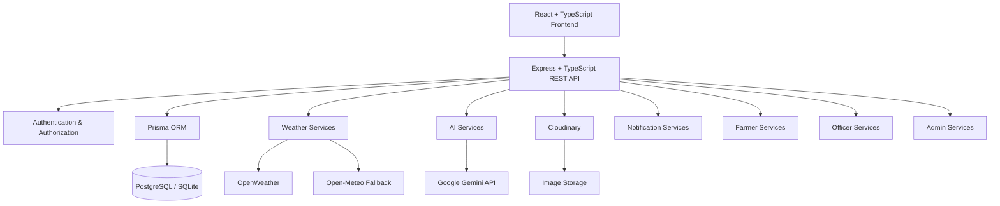

# 🌾 ARVA — Smart Agricultural Advisory & Climate Intelligence System

> **ARVA** is a role-based smart agriculture platform designed to connect **farmers, agricultural officers, and administrators** through AI-powered crop advisory, real-time weather intelligence, disease detection, government schemes, regional alerts, officer assistance, and agricultural community services.

ARVA is designed specifically for farmers who may have **limited digital literacy, limited connectivity, and a preference for regional languages**.

The platform combines:

- 🌦️ Real-time weather intelligence
- 🌾 Crop-specific advisory
- 🤖 Agriculture-focused AI assistant
- 🦠 Crop disease/image detection
- 👨‍🌾 Farmer–Officer communication
- 📢 Regional and nationwide alerts
- 🏛️ Government scheme discovery
- 📊 Agricultural analytics
- 👥 Farmer community
- 📅 Officer appointment management
- 🔔 Notification management
- 🗺️ Region-based officer assignment
- 🗣️ Punjabi, Hindi and English support

---

# 🚀 1. What ARVA Solves

Small and marginal farmers often face several disconnected problems:

- ❌ Difficulty accessing agricultural experts
- ❌ Lack of timely weather-based decisions
- ❌ Difficulty identifying crop diseases
- ❌ Unclear fertilizer and irrigation decisions
- ❌ Limited awareness of government schemes
- ❌ Language and literacy barriers
- ❌ Difficulty reaching the correct agriculture officer
- ❌ Delayed information about regional agricultural risks
- ❌ Lack of a single platform for agricultural support

ARVA brings these services into one platform.

### 🌱 Core Concept

```text
Farmer
   ↓
Farmer Profile + Region + Crop
   ↓
┌─────────────────────────────────────┐
│             ARVA PLATFORM           │
├─────────────────────────────────────┤
│ Weather Intelligence                │
│ Crop Advisory                       │
│ AI Agricultural Assistant           │
│ Disease Detection                   │
│ Government Schemes                  │
│ Regional Alerts                     │
│ Officer Communication               │
│ Appointments                        │
│ Community                           │
└─────────────────────────────────────┘
   ↓
Agriculture Officer
   ↓
Verification / Assistance / Escalation
   ↓
Administrator
   ↓
Governance / Moderation / Management
```

---

# 🏗️ 2. System Architecture

ARVA follows a layered web architecture.



### 🔄 Request Flow

```text
User
 ↓
React Frontend
 ↓
REST API
 ↓
Authentication Middleware
 ↓
Role / Permission Validation
 ↓
Controller
 ↓
Service Layer
 ↓
Prisma ORM
 ↓
Database / External API
 ↓
Response
 ↓
Frontend
```

---

# 🧰 3. Technology Stack

## 🎨 Frontend

| Technology      | Purpose                  |
| --------------- | ------------------------ |
| React           | User interface           |
| TypeScript      | Type safety              |
| Vite            | Development/build system |
| Tailwind CSS    | Responsive styling       |
| React Router    | Application routing      |
| TanStack Query  | Server-state management  |
| Zod             | Validation               |
| React Hook Form | Form management          |

---

## ⚙️ Backend

| Technology     | Purpose               |
| -------------- | --------------------- |
| Node.js        | Runtime               |
| Express.js     | REST API              |
| TypeScript     | Backend type safety   |
| Prisma         | Database ORM          |
| JWT            | Authentication        |
| Multer         | Image upload handling |
| Cloudinary SDK | Image/media storage   |

---

## 🗄️ Database

The application uses Prisma as the database abstraction layer.

Core entities include:

```text
User
Region
FarmerProfile
OfficerProfile
AdminProfile

Post
Comment
Like

Scheme
Broadcast

Appointment

DiseaseCase

BanRequest
TransferRequest

Notification

AIConversation
AIMessage

OfficerReview
SystemSetting
```

The database stores relationships between:

```text
Farmer
 ↓
Region
 ↓
Assigned Officers
 ↓
Appointments / Reports / Disease Cases / Alerts
```

---

# 👥 4. Role-Based Architecture

ARVA has three primary roles.

## 👨‍🌾 FARMER

Farmers are the primary users of the platform.

### Farmer capabilities

- 🏠 Dashboard
- 🤖 AI Assistant
- 🦠 Image Detection
- 🌦️ Weather
- 🌾 Crop Advisory
- 🚨 Alerts
- 👨‍🌾 My Officers
- 📅 Appointments
- 🏛️ Government Schemes
- 👥 Community
- 🔔 Notifications
- 👤 Profile

### Farmer workflow

```text
Register / Login
       ↓
Farmer Profile
       ↓
Select Location
       ↓
State → District → Block → Village
       ↓
Automatic Officer Assignment
       ↓
Farmer Dashboard
       ↓
Weather / Advisory / Alerts / Officers / AI
```

---

# 👨‍💼 5. Agriculture Officer

Officers operate within their assigned geographic jurisdiction.

### Officer capabilities

- 📊 Dashboard
- 👨‍🌾 Assigned Farmers
- 🦠 Disease Cases
- 📅 Appointments
- 📢 Regional Alerts
- 📊 Analytics
- 🔔 Notifications
- 👤 Officer Profile
- 🚨 Farmer Reports
- 🔄 Transfer Requests

### Officer workflow

```text
Officer Account
      ↓
Assigned Regions
      ↓
Farmers within Jurisdiction
      ↓
Farmer Cases / Reports / Appointments
      ↓
Officer Verification
      ↓
Resolution / Escalation
      ↓
Admin when required
```

Officers cannot manage users outside their jurisdiction.

---

# 🛡️ 6. Administrator

Administrators control the overall ARVA ecosystem.

### Admin capabilities

- 📊 Dashboard
- 👥 User Management
- 👨‍💼 Officer Management
- 🗺️ Region Management
- 🏛️ Government Schemes
- 📢 Broadcast Management
- 🚨 Reports
- 🔄 Transfer Requests
- 🔔 Notifications
- 📊 System Analytics
- 👤 Admin Profile
- ⚙️ System Settings

### Administrative workflow

```text
Reports / Requests / Platform Data
              ↓
           ADMIN
              ↓
      Review / Approve / Reject
              ↓
   User / Officer / Region Action
```

---

# 🌦️ 7. Weather Intelligence

Weather is one of ARVA's core non-AI services.

The system retrieves weather information based on the farmer's registered region.

### Weather information

- 🌡️ Current temperature
- 💧 Humidity
- 🌧️ Rainfall
- ☔ Precipitation probability
- 💨 Wind speed
- 🌤️ Weather condition
- 📅 Forecast
- 📈 Historical/previous weather where available

### Weather architecture

```text
Farmer Region
     ↓
Coordinates
     ↓
Weather Service
     ↓
OpenWeather
     ↓
Open-Meteo Fallback
     ↓
Cached Weather Data
     ↓
Farmer / Officer / Admin
```

Weather requests should be cached to reduce unnecessary API calls.

**Important:** Weather retrieval does not consume Gemini AI credits.

---

# 🌾 8. Crop Advisory

Crop Advisory is separate from the weather page.

The farmer explicitly requests an advisory.

```text
Farmer
 ↓
Crop Advisory
 ↓
Get Crop Advice
 ↓
Farmer Profile
+
Crop
+
Growth Stage
+
Soil
+
Irrigation
+
Weather
+
Forecast
 ↓
Advisory Engine
 ↓
Gemini
 ↓
Structured Advisory
```

### Advisory output

ARVA converts AI output into simple farmer-friendly sections:

- 🌾 Crop Status
- 🌦️ Weather Impact
- 💧 Irrigation
- 🌱 Crop Care
- 🐛 Pest Risk
- 🧪 Fertilizer
- ✅ Recommended Actions
- ⚠️ Important Warning

The frontend should never expose raw AI Markdown such as:

```text
##
**
###
---
```

Responses are validated and rendered as structured UI cards.

---

# 🤖 9. ARVA AI Assistant

The AI Assistant is specifically optimized for agricultural queries.

### Supported topics

- 🌾 Crops
- 🌱 Soil
- 💧 Irrigation
- 🧪 Fertilizers
- 🐛 Pests
- 🦠 Diseases
- 🌦️ Weather impact
- 🏛️ Government schemes
- 🚨 ARVA alerts
- 👨‍💼 Agriculture officer assistance

### AI context

ARVA provides Gemini with verified application data when necessary.

For example:

```text
Farmer Question
      ↓
"Which schemes can I apply for?"
      ↓
Backend retrieves actual schemes
      ↓
Eligibility filtering
      ↓
Verified context
      ↓
Gemini
      ↓
Simple localized explanation
```

Gemini should not invent ARVA schemes, alerts, officers, or application information.

---

# 🗣️ 10. Multilingual & Accessibility

ARVA is designed primarily for Punjab farmers.

Supported languages:

- 🇮🇳 Punjabi
- 🇮🇳 Hindi
- 🇬🇧 English

Language preference is stored with the farmer profile.

```text
Farmer Language
       ↓
Backend
       ↓
AI Context
       ↓
Gemini
       ↓
Structured Response
       ↓
Punjabi / Hindi / English
```

### Accessibility goals

- 🔊 Text-to-speech
- 🎙️ Voice interaction
- 🖼️ Image-based questions
- 🧩 Large readable controls
- 🌾 Simple terminology
- 📱 Mobile-first responsive UI
- 🧑‍🌾 Minimal technical language
- 🎨 Icon-based navigation

The objective is not simply translating the interface. The **AI response itself must follow the farmer's selected language**.

---

# 🦠 11. Crop Disease Detection

Farmers can upload crop/leaf images.

```text
Farmer
 ↓
Image Detection
 ↓
Crop Image Upload
 ↓
Cloudinary
 ↓
Gemini Vision
 ↓
Disease Analysis
 ↓
Structured Result
 ↓
Farmer
```

The system can provide:

- 🦠 Suspected disease
- 📊 Confidence
- 🔍 Visible symptoms
- 🌱 Possible causes
- 💊 Recommended action
- 🛡️ Prevention
- ⚠️ Uncertainty warning

Farmers can escalate a case to their Agriculture Officer.

---

# 👨‍💼 12. Officer Disease Verification

AI diagnosis is not treated as final government/field verification.

```text
AI Detection
      ↓
Farmer submits case
      ↓
Assigned Officer
      ↓
Officer reviews image
      ↓
Officer reviews AI result
      ↓
Officer verifies / comments
      ↓
Case resolved
```

This creates a human verification layer.

---

# 👨‍🌾 13. Officer Assignment

Officer assignment is based on geographic coverage.

```text
State
 ↓
District
 ↓
Block
 ↓
Village
 ↓
Officer Coverage
```

A farmer's registered location determines available officers.

Multiple officers can be assigned to the same region.

The farmer can then view:

- 👤 Officer photo
- 🏷️ Designation
- 🎓 Qualification
- 💼 Experience
- 🏢 Department
- 🕐 Calling hours
- 🟢 Availability
- 📞 Phone
- ✉️ Email
- ⭐ Farmer ratings
- 📅 Appointment history

---

# 📅 14. Appointments

Farmers can request appointments with assigned officers.

Officers can:

- Accept
- Reject
- Reschedule
- Add consultation notes
- View appointment history

The backend prevents invalid/past appointments and overlapping bookings.

---

# 🚨 15. Alerts & Broadcasts

Alerts are separate from Crop Advisory.

### Admin

Can publish:

- 🇮🇳 Nationwide alerts
- 🗺️ Regional alerts
- 🌦️ Weather alerts
- 🐛 Pest alerts
- 🏛️ Government announcements

### Officer

Can publish only within their assigned jurisdiction.

```text
ADMIN
 ↓
Nationwide / Regional Broadcast
 ↓
Farmers

OFFICER
 ↓
Assigned Region
 ↓
Regional Broadcast
 ↓
Farmers
```

Officers can manage their own regional broadcasts according to permissions.

---

# 🏛️ 16. Government Schemes

Administrators manage government agricultural schemes.

Farmers can:

- Browse schemes
- Search schemes
- View eligibility
- View benefits
- View required documents
- Open official application links

AI may explain scheme information, but the source data comes from ARVA's verified scheme records.

---

# 👥 17. Farmer Community

ARVA also provides a farmer community platform.

Farmers can:

- 📝 Create posts
- 🖼️ Upload agricultural images
- ❤️ Like posts
- 💬 Comment
- 👀 View other farmer experiences

The community can help farmers share:

- Crop progress
- Disease images
- Farming techniques
- Field conditions
- Local experiences

Moderation remains under administrator control.

---

# 🔔 18. Notifications

Notifications are generated for important events.

Examples:

- 📅 Appointment updates
- 🚨 Regional alerts
- 🏛️ Government announcements
- 🦠 Disease case updates
- 👨‍💼 Officer responses
- 🔄 Transfer request updates
- 🛡️ Account status changes

Unread notifications appear with a badge in the application header.

Notification retention can be controlled through system settings and old notifications can be automatically removed.

---

# 📊 19. Analytics

## 👨‍💼 Officer Analytics

Officer analytics are limited to the officer's jurisdiction.

Metrics include:

- 👨‍🌾 Total farmers
- 🆕 New farmers
- 📈 Farmer growth
- 🦠 Disease cases
- 📅 Appointments
- 📢 Regional broadcasts
- 🗺️ Farmer distribution
- 📋 Recent activity

---

## 🛡️ Admin Analytics

Admin analytics provide a system-wide view.

Metrics include:

- 👨‍🌾 Total farmers
- 👨‍💼 Total officers
- 👥 Active users
- 🚫 Banned users
- 🗺️ Regional distribution
- 🦠 Disease cases
- 📅 Appointment status
- 📢 Broadcast activity
- 🏛️ Scheme count
- 👥 Community activity
- 📈 User growth

Charts and graphs are based on actual database data.

---

# 🔐 20. Authentication & Security

ARVA uses role-based authentication.

### Authentication

- Email/password authentication
- Google authentication
- JWT-based sessions
- Protected API routes

### Authorization

```text
FARMER
 ↓
Farmer resources

OFFICER
 ↓
Officer resources
+
Assigned jurisdiction

ADMIN
 ↓
System-wide resources
```

### Security rules

- 🔐 Password hashes are never returned to frontend clients.
- 🛡️ Protected endpoints validate authentication.
- 🚫 Banned users cannot access protected services.
- 👨‍💼 Officers cannot manage users outside their jurisdiction.
- 🛡️ Admin-only operations are protected.
- 🔑 API keys remain server-side.
- 🖼️ Uploaded files are validated before storage.

---

# ☁️ 21. Media Storage

Images are not stored directly inside the database.

```text
Frontend
 ↓
Backend
 ↓
File Validation
 ↓
Cloudinary
 ↓
Secure Image URL
 ↓
Database
```

Used for:

- 👤 Profile photos
- 🌾 Crop images
- 🦠 Disease cases
- 👥 Community posts

---

# 🗂️ 22. Project Structure

```text
ARVA/
│
├── backend/
│   ├── prisma/
│   │   ├── schema.prisma
│   │   └── seed.ts
│   │
│   └── src/
│       ├── controllers/
│       ├── routes/
│       ├── services/
│       ├── middleware/
│       ├── validators/
│       ├── utils/
│       └── server.ts
│
├── frontend/
│   └── src/
│       ├── components/
│       ├── pages/
│       ├── layouts/
│       ├── context/
│       ├── services/
│       ├── hooks/
│       └── App.tsx
│
└── README.md
```

---

# 🔄 23. Major End-to-End Workflows

## 🌾 Farmer Advisory

```text
Login
 ↓
Farmer Profile
 ↓
Region + Crop
 ↓
Weather
 ↓
Crop Advisory
 ↓
Get Crop Advice
 ↓
Advisory Engine
 ↓
Gemini
 ↓
Structured Advisory
```

## 🦠 Disease Escalation

```text
Image Upload
 ↓
AI Detection
 ↓
Disease Case
 ↓
Assigned Officer
 ↓
Officer Verification
 ↓
Resolution
```

## 👨‍💼 Officer Management

```text
Officer
 ↓
Assigned Region
 ↓
Farmers
 ↓
Disease / Appointment / Reports
 ↓
Officer Action
 ↓
Admin Escalation
```

## 🚨 Alert System

```text
Admin → Nationwide / Regional → Farmers

Officer → Assigned Region → Farmers
```

---

# 🌐 24. Environment Variables

## Backend

Create:

```text
backend/.env
```

```env
PORT=5000

DATABASE_URL="..."

JWT_SECRET="..."

GEMINI_API_KEY="..."

GEMINI_MODEL="gemini-3.6-flash"

CLOUDINARY_CLOUD_NAME="..."
CLOUDINARY_API_KEY="..."
CLOUDINARY_API_SECRET="..."

OPENWEATHER_API_KEY="..."
```

> Never commit `.env` files or API keys to GitHub.

## Frontend

```text
frontend/.env
```

```env
VITE_API_URL="http://localhost:5000/api"
```

---

# ⚙️ 25. Local Installation

## Requirements

- Node.js 18+
- npm
- Database configured in `.env`
- Gemini API key
- Cloudinary credentials
- OpenWeather API key

### Backend

```bash
cd backend
npm install

npx prisma generate
npx prisma db push

npm run dev
```

### Frontend

```bash
cd frontend
npm install

npm run dev
```

Frontend:

```text
http://localhost:5173
```

Backend:

```text
http://localhost:5000
```

---

# 🧪 26. Testing & Validation

Before deployment:

```bash
cd backend
npm run build
```

```bash
cd frontend
npm run build
```

Verify:

- ✅ Authentication
- ✅ Role protection
- ✅ Farmer onboarding
- ✅ Officer assignment
- ✅ Weather
- ✅ Crop advisory
- ✅ AI assistant
- ✅ Image detection
- ✅ Alerts
- ✅ Government schemes
- ✅ Community
- ✅ Appointments
- ✅ Notifications
- ✅ Officer analytics
- ✅ Admin analytics
- ✅ Reports
- ✅ Transfer requests
- ✅ Responsive layouts

---

# 📱 27. Responsive Design

ARVA is designed for:

- 🖥️ Desktop
- 💻 Laptop
- 📱 Mobile
- 📲 Tablet

Desktop provides full dashboard layouts.

Mobile uses a compact header with:

```text
ARVA                         🔔 👤 ☰
```

Navigation is placed inside the hamburger drawer to avoid overcrowding the mobile interface.

The drawer contains the complete navigation relevant to the logged-in role.

---

# 🎯 28. Design Principles

ARVA follows an agriculture-focused visual system.

### Visual language

🌿 Emerald green
🌾 Warm agricultural tones
🟡 Amber highlights
🤍 Clean cards
📱 Responsive layouts
♿ Accessible controls

The interface prioritizes:

1. Clarity
2. Accessibility
3. Readability
4. Low cognitive load
5. Mobile usability
6. Farmer-friendly terminology

---

# 🔮 29. Future Expansion

ARVA can later be extended with:

- 🛰️ Satellite crop monitoring
- 🗺️ Field-level mapping
- 📡 IoT soil sensors
- 📈 Yield prediction
- 💰 Market-price intelligence
- 📩 SMS advisory delivery
- 📞 IVR-based farmer support
- 🌐 Additional Indian languages
- 🧠 Specialized agricultural ML models
- 🏛️ Government system integrations

These are expansion areas and should not be confused with the currently implemented core platform.

---

# 🏆 30. Smart India Hackathon Context

**Problem Statement:** SIH25010
**Domain:** Agriculture & Rural Development
**Platform:** Web-based Smart Crop Advisory System
**Primary Region:** Punjab, India

ARVA demonstrates how government agricultural services can be connected through a single digital platform combining:

```text
🌦️ Weather
+
🌾 Crop Intelligence
+
🤖 AI
+
🦠 Disease Detection
+
👨‍💼 Human Expert Verification
+
🏛️ Government Services
+
📢 Regional Communication
+
📊 Data Analytics
```

The central objective is simple:

> **Give farmers the right agricultural information, in the right language, at the right time, while keeping human agricultural officers in the decision-support loop.**

---

# 📌 Project Status

ARVA is being developed as a production-oriented prototype for the Smart India Hackathon.

The development priority is:

```text
Core Platform
      ↓
Reliable Farmer / Officer / Admin Workflows
      ↓
Weather Intelligence
      ↓
AI Crop Advisory
      ↓
Disease Detection
      ↓
Human Officer Verification
      ↓
Analytics & Government Services
      ↓
Scalability & Deployment
```

---

## 👨‍💻 Development

**ARVA — Smart Agricultural Advisory & Climate Intelligence System**

Built with:

**React + TypeScript + Express + Prisma + Gemini + Cloudinary + Weather APIs**

Designed for:

**Farmers • Agriculture Officers • Government Administrators**

🌾 **Technology for better agricultural decisions.**
