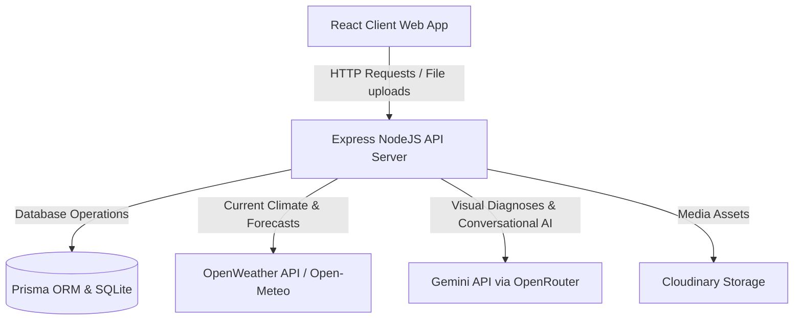

# 🌾 ARVA: Smart Agricultural Advisory & Climate Intelligence System

ARVA is a state-of-the-art Web Application designed to empower farmers and agricultural officers across Punjab with weather-aware crop diagnostics, government scheme discovery, regional broadcast alerts, and expert case escalations. Combining localized soil characteristics and real-time micro-climate inputs, ARVA utilizes advanced AI models to compile actionable field advisories in Punjabi, Hindi, and English.

---

## 🚀 Architectural Overview & Core Features

ARVA's architecture integrates specialized web layers, backend micro-services, and cloud-hosted AI providers:



### 1. Unified Drawer Navigation (Hamburger Menu)
Unified navigation layout for Farmers, Officers, and Administrators:
*   **Farmer Drawer**: Includes *Dashboard*, *AI Assistant*, *Image Detection*, *Weather*, *Crop Advisory*, *Alerts*, *Profile*, *My Officers*, *Community*, *Government Schemes*, *Appointments*, and *Notifications*.
*   **Officer Drawer**: Includes *Dashboard*, *Farmers*, *Disease Cases*, *Appointments*, *Regional Alerts*, *Notifications*, *Analytics*, and *Profile*.
*   **Administrator Drawer**: Includes *Dashboard*, *Users*, *Officers*, *Regions*, *Schemes*, *Broadcasts*, *Reports*, *Requests*, *Notifications*, *Analytics*, and *Profile*.

### 2. Live Weather Core (OpenWeather & Open-Meteo Fallback)
*   **Dynamic Weather Fetching**: Integrates OpenWeather API forecast queries when configured via `OPENWEATHER_API_KEY` in the environment files.
*   **Zero-Failure Fallback**: If unconfigured or the query quota is exhausted, the server seamlessly switches to Open-Meteo APIs.
*   **Farmer Dashboard Card**: Displays current temperature, location coordinates, windspeed, relative humidity, precipitation probability, and wind descriptions without triggering Gemini.

### 3. Separate Alerts & AI Crop Advisories
*   **Real-time Alerts Widget**: Isolates notifications, warnings, and emergency broadcasts from general crop advice.
*   **Manual Crop Advisory Generation**: Prevents automated Gemini calls on load. Crop advice is generated explicitly when the farmer triggers **Get Crop Advice** or **Regenerate Advice**.

### 4. Optional Onboarding & Custom Crop Inputs
*   **Skip Option**: Onboarding does not block user progress. Step 3 agricultural characteristics (Land Size, Soil, Irrigation, Crop, Growth Stage) are optional.
*   **Custom Sown Crop**: Farmers can choose "Other" and type in their specific crops (e.g., Mustard, Lentils). Sensible default values are supplied for skipped fields to satisfy database model integrity.

### 5. Chat UX & Agricultural Guardrails
*   **Immediate Message Rendering**: When a farmer enters a question, it renders instantly, followed by a typing indicator while Gemini compiles the advice.
*   **Predefined Question Suggestions**: Provides helpful suggestions in blank chat states.
*   **Structured JSON Responses**: Returns structured JSON arrays for different categories (Crop Status, Irrigation, Weather, Pest Risk, Crop Care) and renders them as thematic cards.
*   **Keyword-Based Guardrails**: Instantly rejects off-topic queries with a polite localized message without calling the LLM.

### 6. Hybrid Punjabi Speech Reader (TTS Fallback)
*   **Double-Engine TTS**: Searches for a native Gurmukhi voice (`pa-IN`) first.
*   **Public Translation TTS Stream Fallback**: If no native Punjabi voice is installed in the host browser, it falls back to streaming sentence chunks from a public translation TTS service sequentially.

---

## 🛠️ Step-by-Step Installation & Setup

### Prerequisites
*   Node.js (v18.0.0 or higher)
*   npm or yarn
*   SQLite3

### 1. Environment Configuration

#### Backend Env (`/backend/.env`)
Create a `.env` file in the `backend/` directory:
```env
PORT=5000
DATABASE_URL="file:./dev.db"
JWT_SECRET="your_secure_jwt_secret_key"
OPENROUTER_API_KEY="your_openrouter_gemini_key"
CLOUDINARY_CLOUD_NAME="your_cloudinary_cloud_name"
CLOUDINARY_API_KEY="your_cloudinary_api_key"
CLOUDINARY_API_SECRET="your_cloudinary_api_secret"

# Optional: Set this to enable premium current weather forecasts
OPENWEATHER_API_KEY="your_openweather_api_key"
```

#### Frontend Env (`/frontend/.env`)
Create a `.env` file in the `frontend/` directory:
```env
VITE_API_URL="http://localhost:5000/api"
```

### 2. Backend Setup & Database Initialization

```bash
# Navigate to the backend folder
cd backend

# Install project dependencies
npm install

# Run Prisma schema migrations to set up the SQLite database
npx prisma migrate dev --name init

# Seed initial regional coordinates, schemes, and user credentials
npm run seed

# Start the backend development server
npm run dev
```

### 3. Frontend Setup & Run

```bash
# Navigate to the frontend folder
cd ../frontend

# Install dependencies
npm install

# Launch Vite local dev server
npm run dev
```

The application will be accessible at [http://localhost:5173](http://localhost:5173).

---

## 🧪 Verification & Manual Testing Guidelines

To verify that the newly added refinements function correctly:

1.  **Onboarding Skip & Defaults**:
    *   Register a new farmer account.
    *   In Step 3, leave the agricultural details empty, click "Complete Onboarding", and ensure it routes you to the dashboard successfully.
2.  **Weather Card & Dynamic API**:
    *   Verify the weather card is rendered on the dashboard.
    *   Temporarily append `OPENWEATHER_API_KEY` to `backend/.env` and verify the server fetches humidity and condition strings from OpenWeather. Clear it to verify the Open-Meteo fallback.
3.  **Advisory Manual Compilation**:
    *   Navigate to **Crop Advisory** (/farmer/advisory).
    *   Verify it shows "No Crop Advisory Generated Yet". Click **Get Crop Advice** and check the loading state and compiled card outputs.
4.  **Punjabi TTS Hybrid Speech**:
    *   Go to Profile and set language preference to **Punjabi**.
    *   Open the AI Assistant or Crop Advisory, click **Listen Advisory**, and verify Gurmukhi speech synthesis output.
